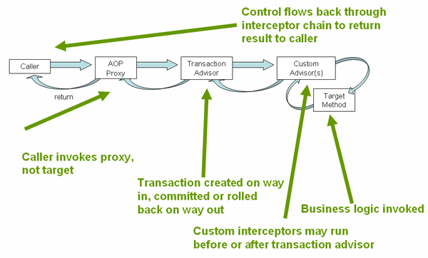

## AOP란?

AOP는 Aspect Oriented Programming의 약자로 관점 지향 프로그래밍을 뜻한다. 여기서 관점 지향이란, **어떤 로직을 기준으로 핵심적인 관점, 부가적인 관점으로 나누어서 보고 그 관점을 기준으로 각각 모듈화**를 하겠다는 것.

여기서 **핵심적인 관점**이란 **핵심 비즈니스 로직**을 뜻하고, **부가적인 관점**이란 **핵심 로직을 실행하기 위해 행해지는 데이터베이스 설계, 로깅, 파일 입출력 등**을 뜻한다.

각 관점을 기준으로 모듈화 한다는 것은 코드를 부분적으로 나누어 모듈화한다는 의미이다. 이때 **소스코드상에서 다른 부분에 계속 반복하여 쓰는 코드들**을 발견할 수 있는데, 이를 **흩어진 관심사**라고 한다. 이 흩어진 관심들을 Aspect로 모듈화하고 핵심 비즈니스 로직에서 재사용하겠다는 것이 AOP의 취지다.


AOP 없이 흩어진 관심사를 처리하면 다음과 같은 문제가 발생한다.

- 여러 곳에서 반복적인 코드를 작성해야 한다.
- 코드가 변경될 경우 여러 곳에 가서 수정이 필요하다.
- 주요 비즈니스 로직과 부가 기능이 한 곳에 섞여 가독성이 떨어진다.

<br>

### 주요 개념

- Aspect
    - 흩어진 관심사를 모듈화한 것
    - 주로 부가 기능을 모듈화 함.
- Target
    - Aspect를 적용하는 곳 (클래스, 메서드, ...)
- Advice
    - 실질적으로 어떤 일을 해야할 지에 대한 것
    - 실질적인 부가 기능을 담은. 구현체
- JointPoint
    - Advice가 적용될 위치, 끼어들 수 있는 지점
    - 메서드 진입 지점, 생성자 호출 시점, 필드에서 값을 꺼내는 때 등 다양한 시점에 적용 가능
- PointCut
    - JointPoint의 상세한 스펙을 정의한 것
    - `A한 메서드의 진입 시점에 호출할 것`과 같이 구체적으로 Advice가 실행될 시점을 정할 수 있음.

<br>

### 스프링 AOP 특징

- 프록시 패턴 기반의 AOP 구현체, 프록시 객체를 쓰는 이유는 **접근 제어 및 부가기능을 추가**하기 위해서임
- 스프링 빈에만 AOP 적용 가능
- 모든 AOP 기능을 제공하는 것이 아닌 IoC와 연동하여 *엔터프라이즈 애플리케이션에서 가장 흔한 문제*에 대한 해결첵을 지원하는 것이 목적

> *엔터프라이즈 애플리케이션에서 가장 흔한 문제*: 중복 코드, 프록시 클래스 작성의 번거로움, 객체들간의 관계 복잡도 증가.

<br>

## AOP와 Transactional의 관계

Spring AOP는 프록시 방식으로 동작한다. **프록시 패턴**이란 어떤 객체를 사용하고자할 때, 객체를 직접적으로 참조하는 것이 아니라, 해당 객체를 대행(대리, proxy)하는 객체를 통해 대상에 접근하는 방식을 말한다.

<br>

### Spring AOP는 왜 프록시 방식으로 동작할까

프록시 객체 없이 Target을 사용할 경우 Aspect 클래스에 정의된 부가 기능을 사용하기 위해 원하는 위치에서 직접 Aspect를 호출해야 한다. 이럴 경우 여러 곳에서 반복적으로 Aspect를 호출해야 하므로 유지보수성이 떨어진다.

그래서 Spring에서는 Target 클래스 혹은 그의 상위 인터페이스를 상속하는 프록시 클래스를 생성하고, 프록시 클래스에서 부가 기능에 관련된 처리를 한다. 이렇게 하면 Target에서 Aspect을 알 필요 없이 순수한 비즈니스 로직에 집중할 수 있다.

<br>

#### 예시

예를 들어 logic 메서드가 Target이라고 할 때,

```java

public interface TargetService{
    void logic();
}

@Service 
public class TargetServiceImpl implements TargetService{
    @Override 
		public void logic() {
        ...
}}

```

Proxy에서 Target 전/후에 부가 기능을 처리하고 Target을 호출한다.

```java
@Service 
public class TargetServiceProxy implements TargetService{ 
		// 지금은 구현체를 직접 생성했지만, 외부에서 의존성을 주입 받도록 할 수 있다.
		TargetService targetService = new TargetServiceImpl();
		...

		@Override 
		public void logic() {
        // Target 호출 이전에 처리해야하는 부가 기능
				
        // Target 호출
		targetService.logic();

        // Target 호출 이후에 처리해야하는 부가 기능
    }
}
```

사용하는 입장에서는 Target 객체를 사용하는 것처럼 Proxy 객체를 사용할 수 있다.

```java
@Service 
public class UseService{ 
		// 지금은 구현체를 직접 생성했지만, 외부에서 의존성을 주입 받도록 할 수 있다.
		TargetService targetService = new TargetServiceProxy();
		...
		
		public void useLogic() {
        // Target 호출하는 것처럼 부가 기능이 추가된 Proxy를 호출한다.
				targetService.logic();
    }
}
```

<br>

### JDK Proxy와 CGLib Proxy

Spring에서는 몇 가지 설정을 하면 자동으로 Target의 프록시 객체를 생성해주는데, JDK Proxy(Dynamic Proxy)와 CGLib Proxy를 만들 수 있다.

두 방식의 가장 큰 차이점은 **Target의 어떤 부분을 상속 받아서 프록시를 구현하느냐**에 있다.


- JDK Proxy
    - Target의 상위 인터페이스를 상속 받아 프록시를 만듦
    - 인터페이스를 구현한 클래스가 아니면 의존할 수 없음
    - Target에서 다른 구체 클래스에 의존하고 있다면, JDK 방식에서는 그 클래스(빈)를 찾을 수 없어 런타임 에러가 발생
    - 내부적으로 Reflection을 사용해서 추가적인 비용

- CGLib Proxy
    - Target 클래스를 상속 받아 프록시를 만듦
    - JDK 방식과는 달리 인터페이스를 구현하지 않아도 되고, 구체 클래스에 의존하기 때문에 런타임 에러가 발생할 확률도 상대적으로 적다.
    - 내부적으로 Reflection을 사용하지 않아 추가적인 비용 없음
    - Spring Boot에서는 기본으로 채택

<br>

### Proxy 형태로 동작하는 Transactional

트랜잭션 처리를 위한 Transactional 애노테이션은 Spring AOP의 대표적인 예이다.



1. target에 대한 호출이 들어오면 AOP proxy가 이를 가로채서(intercept) 가져온다.
2. AOP proxy에서 Transaction Advisor가 commit 또는 rollback 등의 트랜잭션 처리를 한다.
3. 트랜잭션 처리 외에 다른 부가 기능이 있을 경우 해당 Custom Advisor에서 그 처리를 한다.
4. 각 Advisor에서 부가 기능 처리를 마치면 Target Method를 수행한다.
5. interceptor chain을 따라 caller에게 결과를 다시 전달한다.

```java
public class TransactionProxy{
    private final TransactonManager manager = TransactionManager.getInstance();
		...

    public void transactionLogic() {
        try {
            // 트랜잭션 전처리(트랜잭션 시작, autoCommit(false) 등)
			manager.begin();

			// 다음 처리 로직(타겟 비스니스 로직, 다른 부가 기능 처리 등)
			target.logic();
            
			// 트랜잭션 후처리(트랜잭션 커밋 등)
            manager.commit();
        } catch ( Exception e ) {
			// 트랜잭션 오류 발생 시 롤백
            manager.rollback();
        }
    }
}
```

<br>

### 특징

1. private은 트랜잭션 처리를 할 수 없다.

프록시 객체는 타겟 객체/인터페이스를 상속 받아서 구현하는데, private으로 되어 있으면 자식인 프록시 객체에서 호출할 수 없다. 따라서 `@Transactional`이 붙는 메서드, 클래스는 프록시 객체에서 접근 가능한 레벨로 지정해야 한다.

2. 트랜잭션은 객체 외부에서 처음 진입하는 메서드를 기준으로 동작한다.


클래스에 @Transactional 처리가 되어 있는 부분이 있다면, Spring은 해당 부분에 트랜잭션 처리를 추가한 프록시를 자동으로 생성한다. 그리고 외부에서 호출하면, 원래 클래스가 아닌 프록시가 대신 호출된다.

- C 메서드를 호출하면, TestService가 아닌 TestService의 프록시에 구현된 C 메서드가 대신 호출된다. 따라서 C와 C에서 호출하는 A 모두 프록시 객체에서 트랜잭션 처리를 해준다.

- 하지만 B 메서드를 호출하는 것은 트랜잭션 처리가 되어 있지 않은 순수 B 메서드를 호출하는 것과 같다. 이때 B에서 호출하는 A 역시 트랜잭션 처리가 되어 있지 않다.


<br>

## 출처

- [[Spring] 스프링 AOP (Spring AOP) 총정리 : 개념, 프록시 기반 AOP, @AOP](https://engkimbs.tistory.com/entry/%EC%8A%A4%ED%94%84%EB%A7%81AOP)
- [[Spring] AOP와 @Transactional의 동작 원리](https://velog.io/@ann0905/AOP%EC%99%80-Transactional%EC%9D%98-%EB%8F%99%EC%9E%91-%EC%9B%90%EB%A6%AC)