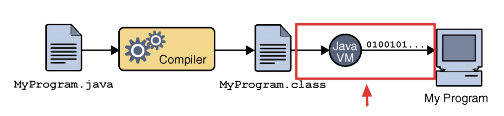
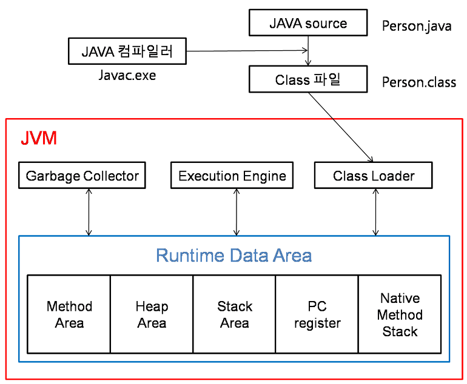

## Jvm이란?



JVM이란 **자바 가상 머신(Java Virtual Machine)**의 약자이다.
메모리 관리(GC)를 수행하며 스택(Stack) 기반으로 동작하고 Java Byte Code를 운영체제(OS)에 맞게 해석해주는 역할

### 동작 방식



1. 자바로 개발된 프로그램을 실행하면 JVM은 OS로부터 메모리를 할당한다.
2. 자바 컴파일러(javac)가 자바 소스코드(.java)를 자바 바이트코드(.class)로 컴파일한다.
3. Class Loader를 통해 JVM Runtime Data Area로 로딩
4. Runtime Data Area에 로딩 된 .class들은 Execution Engine을 통해 해석한다.
5. 해석된 바이트 코드는 Runtime Data Area의 각 영역을 활용하며 Execution Engine에 의해 실행된다. 이때 객체 관리와 메모리 해제는 JVM 내부의 GC 스레드가 수행하고, 스레드 동기화는 JVM이 제공하는 모니터 메커니즘을 통해 관리된다.

<br>

## 메모리 영역

자바의 메모리 공간은 크게 Method 영역, Stack 영역, Heap 영역으로 구분되고, 데이터 타입에 따라 할당된다.

### 메소드(Method) 영역

**전역변수**와 **static변수**, **메소드**를 저장하며, JVM이 동작해서 클래스가 로딩될 때 생성된다. 간단히 말하면, **프로그램의 시작부터 종료까지** 메모리에 남아있다는 뜻이다..

### 스택(Stack) 영역

스택 영역은 **스레드별로 할당되는 독립적인 런타임 스택**이다. 스레드 생성 시 스택 크기가 정해지고 런타임에 동적으로 push/pop된다. 기본자료형, 지역변수와 매개변수 데이터 값이 저장되는 공간이며, 메소드가 호출될 때 메모리에 할당되고 종료되면 메모리가 해제된다. LIFO(Last In First Out) 구조를 갖고 변수에 새로운 데이터가 할당되면 이전 데이터는 지워진다. 메소드가 호출될 때 할당된다.

### 힙(Heap) 영역

**동적으로 할당된 영역**이며, 런타임 시 할당된다. new 키워드로 생성되는 객체(인스턴스), 배열 등이 Heap 영역에 저장되며, 가비지 컬렉션에 의해 메모리가 관리되어 진다.

#### String 값과 오브젝트로 저장하기.

힙 메모리 내에는 String constant pool이 존재한다. String constant pool이란 자바에서 문자열 리터럴을 저장하는 공간이다.

> Java 6 버전 이하의 경우 Permanent Generation (PermGen)이라는 특수한 영역에 String Pool이 위치하였다. PermGen은 메타데이터와 클래스 정보를 저장하는 영역이었으며, 기본적으로 크기가 고정되어 있어 런타임에 String Pool이 가득 차면 OutOfMemoryError: PermGen space가 발생하였다.<br><br>이 영역의 객체들은 GC 대상이 되지 않거나 GC가 매우 비효율적으로 수행되었다.그러나 Java 7 버전 이후 Heap 영역으로 이동하였으며 현재는 GC의 대상이다.

예를 들어,

`String name = "apple";`로 초기화할 경우 Heap 내의 String constant pool에 저장되며 `String name = new String("apple");`로 저장할 경우 Heap에 저장된다.

```java
String name = "apple";
String name2 = "apple";

String name3 = new String("apple");

System.out.println(name == name2); // true
System.out.println(name == name3); // false
```

### Stack 영역은 Stack 자료구조의 특성을 그대로 따른다.

메소드가 호출될 때마다 해당 메소드의 정보(매개변수, 지역 변수, 반환 주소 등)가 **스택 프레임(Stack Frame)** 으로 만들어져 Stack 영역에 **푸시(Push)** 된다. 메소드 실행이 끝나면 해당 스택 프레임이 Stack 영역에서 **팝(Pop)** 되어 사라진다.

#### 예시

- `static String s = "sss"`라고 했을 때 "sss"는 Heap의 `string constant pool`에 저장되고 `String s`는 메소드 영역에 저장
- `static Person p = new Person`이런 식으로 하면 이 person 객체가 heap에 저장되고 그 참조값은 **메소드 영역에서 참조**


### 스레드 관점에서 stack과 heap

Stack 의 메모리는 Thread당 하나씩 할당된다. 만약 새로운 스레드가 생성되면 해당 스레드에 대한 Stack이 새롭게 생성되고, 각 스레드 끼리는 Stack 영역을 접근할 수가 없다.

자바(Java)에서 스레드 간의 데이터 공유는 **힙(Heap) 영역**을 통해 이루어진다.

- stack - 스레드 독립 영역
  - **저장 내용**: 메서드 호출 시 사용되는 **지역 변수(기본 타입)**, **매개 변수**, 그리고 객체를 참조하는 **참조 변수(주소값)** 등이 저장되는 곳입니다.
  - **공유 여부**: 스레드별로 독립적이므로, **데이터를 공유할 수 없다.**
- Heap (힙) - 스레드 공유 영역
  - **저장 내용**: 프로그램에서 생성되는 모든 **객체(인스턴스)**와 **배열**이 저장된다.
  - **공유 여부**: JVM 내의 **모든 스레드가 공유**하는 영역이다.

#### 스레드 간 데이터 공유 원리

스레드 A와 스레드 B가 데이터를 공유하는 방식은 다음과 같다.

1. **객체 생성**: 프로그램 실행 중 공유하고 싶은 데이터(`ObjectA`)가 **힙 영역**에 생성됩니다.
2. **참조 저장**: 스레드 A와 스레드 B는 각각 자신들의 **스택 영역**에 `ObjectA`를 가리키는 **참조 변수(주소값)**를 저장합니다.
3. **공유 접근**: 두 스레드가 각자의 스택에 저장된 **참조 변수**를 통해 힙 영역에 있는 동일한 객체(`ObjectA`)에 접근하여 데이터를 읽거나 수정할 수 있습니다.

따라서 **객체 자체**는 **힙(공유 영역)**에, 객체를 가리키는 **참조(독립 영역)**는 **스택**에 저장됨으로써 스레드 간 데이터 공유가 가능해지는 것입니다.

> **⚠️ 주의: 동기화(Synchronization) 필요**<br><br>스레드가 힙 영역의 공유 데이터에 동시에 접근하여 수정할 경우, 데이터 불일치(Race Condition) 문제가 발생할 수 있다. 따라서 공유 데이터를 다룰 때는 `synchronized` 키워드나 `Lock` 등의 **동기화 기법**을 사용하여 데이터의 안정성을 보장해야 한다.

<br>

## 자바 메모리 모델 (Java Memory Model, JMM)

### 메인 메모리 vs. 워킹 메모리

JMM은 스레드가 공유하는 **힙 메모리(메인 메모리)**와 각 스레드가 사용하는 스택/캐시(워킹 메모리) 간의 상호작용 규칙을 정의한다.

이 개념은 스레드가 데이터를 읽고 쓰는 방식에 대한 모델입니다. JMM은 성능 최적화를 위해 스레드가 모든 데이터에 직접 메인 메모리(힙)를 통하지 않고 각자의 CPU 캐시를 사용할 수 있도록 허용합니다.

- 메인 메모리 (Main Memory)
	- 실제 영역: JVM의 힙(Heap) 영역
	- 저장 내용: 모든 스레드가 공유하는 **인스턴스 변수(필드)**와 **정적 변수(static 필드)**의 실제 값이 저장됩니다.
	- 특징: 여러 스레드가 동시에 접근하며, 이 때문에 데이터 불일치 문제가 발생할 수 있습니다.

- 워킹 메모리 (Working Memory)
	- 실제 영역
		- 각 스레드에 할당된 스택(Stack) 영역과 CPU의 **캐시(Cache)**를 포괄하는 개념
	- 저장 내용
		- 스레드가 사용할 변수의 로컬 복사본이 저장
		- 스레드는 일반적으로 메인 메모리에서 데이터를 가져와 워킹 메모리에서 작업을 수행
	- 문제
		- 한 스레드가 워킹 메모리에서 변수 값을 변경해도, 그 변경 사항이 즉시 메인 메모리에 반영되거나 다른 스레드의 워킹 메모리에 업데이트되지 않아 **데이터 불일치(Inconsistency)**가 발생

JMM의 역할은 이 워킹 메모리(캐시)의 변경 사항이 언제, 어떻게 메인 메모리와 동기화되어야 하는지에 대한 규칙을 제공하는 것.

### 가시성(Visibility)과 순서(Ordering)

여러 스레드가 동시에 변수에 접근할 때 데이터의 일관성과 예측 가능성을 보장하는 규칙이다.

- 가시성 (Visibility)
	- 한 스레드가 변수의 값을 변경했을 때, 다른 스레드가 변경된 최신 값을 볼 수 있는지 여부
	- 문제 발생
		- 스레드가 변수를 워킹 메모리(캐시)에 복사하여 작업하고 메인 메모리에 반영하지 않으면, 다른 스레드는 여전히 **오래된 값(Stale Value)**을 읽게 된다.
	- 해결책
		- volatile, synchronized, Lock 등의 동기화 메커니즘을 사용하면, 해당 변수의 값이 메인 메모리와 동기화되어 모든 스레드가 최신 값을 볼 수 있게 된다.

- 순서 (Ordering)
	- 정의: 코드가 작성된 순서와 JVM 또는 CPU가 명령어를 실제로 실행하는 순서가 다를 수 있다 (명령어 재배치, Instruction Reordering).
	- 문제 발생
		- 성능 최적화를 위해 컴파일러나 CPU가 명령어의 실행 순서를 바꾸었는데, 이 재배치가 다른 스레드의 로직 흐름을 깨뜨릴 때 발생한다
		- 예) 초기화가 완료되기 전에 참조가 노출되는 경우.
	- 해결책
		- 동기화 메커니즘을 사용하면 **메모리 배리어(Memory Barrier)**가 삽입되어, 특정 지점의 명령어 재배치를 금지함으로써 스레드 간의 순서 일관성을 보장한다.

### volatile 키워드

변수의 값을 항상 메인 메모리에서 읽어오고 쓰도록 강제하여 가시성 문제를 해결하는 방법을 제공힌다.

<br>

## StackOverflowError와 OutOfMemoryError

|   특징    |     StackOverflowError     |         OutOfMemoryError         |
| :-------: | :------------------------: | :------------------------------: |
| 발생 영역 |    Stack (스택) 메모리     | Heap (힙) 메모리 또는 Metaspace  |
| 주요 원인 | 무한 재귀 호출 (깊은 재귀) | 메모리 누수, 너무 많은 객체 생성 |
| 문제 성격 |   로직 오류 (무한 루프)    |   메모리 부족 (GC가 해결 불가)   |

메서드 호출이 너무 깊어지거나(재귀 호출), 스택에 너무 많은 지역 변수가 쌓여 할당된 스택 메모리 크기를 초과하게 되면, JVM은 더 이상 새로운 스택 프레임을 할당할 수 없어 **StackOverflowError**를 발생시키고 해당 스레드는 중단된다.

<br>

## 메모이제이션

대부분의 메모이제이션 구현은 힙 메모리를 사용하며, 이 영역에 가장 큰 영향을 미친다.

- 저장 공간: 힙 메모리 (Heap)
- 저장 방식: 메모이제이션 캐시(예: HashMap, ArrayList, 전역 배열)는 객체이므로 힙 메모리에 할당됩니다.

### 영향

- 메모리 사용량 증가
  - 계산 결과를 저장하기 위해 데이터가 누적될수록 힙 사용량이 증가
  - 시간복잡도(Time Complexity)를 공간복잡도(Space Complexity)로 교환하는 전형적인 형태
- GC 부하
  - 캐시 크기가 커지면 가비지 컬렉터(GC)가 관리해야 할 객체의 수가 늘어나 GC 부하가 증가할 수 있음
- 메모리 누수 위험
  - 캐시를 정적(static) 필드로 선언하고 데이터를 제거하지 않으면, 힙 메모리 누수를 일으켜 OutOfMemoryError를 유발할 수 있음

#### 최적화 : 참조 Locality

힙에 저장된 캐시 데이터에 자주 접근하면 **CPU 캐시 히트율(Cache Hit Ratio)**이 높아져 데이터 접근 속도가 빨라질 수 있다.

### 스택(Stack) 메모리 영역과 메모이제이션

메모이제이션은 스택 메모리 자체의 사용량이나 깊이를 직접적으로 줄여준다.

#### 재귀 호출의 깊이 감소
- 스택 프레임 감소
	- 재귀 함수에 메모이제이션을 적용하면, 이미 계산된 결과가 캐시에 있을 경우 **메서드 호출(재귀)**이 발생하지 않고 곧바로 반환된다.

- 스택 오버플로우 방지 효과
	- 이로 인해 스택 프레임이 불필요하게 깊어지는 것을 방지할 수 있다.
	- 즉, 메모이제이션은 간접적으로 스택 메모리를 보호하여 StackOverflowError 발생 가능성을 낮춘다.

#### 스택 사용량 변화

- 스택 메모리 절약
	- 메모이제이션된 함수를 호출할 때마다 새로운 스택 프레임을 쌓지 않기 때문에, 스택 메모리 사용량이 절약된다.