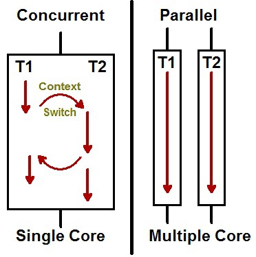

## 기본 지식

### 프로세스와 스레드

> **Process** : 보조기억장치의 '프로그램'이 **메모리 상으로 적재되어 실행되면 '프로세스'**가 된다.  
> **Thread** : 같은 Process 내에서 실행되는 **여러 작업 (흐름)의 단위**


### 동시성(Concurrency)과 병렬성(Parallelism)


**동시성 프로그래밍**은 말 그대로 **동시에 여러 작업**을 수행하는 것이다. 하지만 눈으로 보기에 동시에 실행되는 것이지, 사실 **시분할(Interleaving) 기법을 활용**하여 여러 작업을 **조금씩 나누어서 번갈아가며 실행**한다.

Task 1 과 Task 2 를 **잘개 쪼개어 번갈아가며 수행**하여 사용자 입장에선 두 작업이 **동시에 일어나는 것처럼 느껴지게** 된다. 따라서 순수 작업시간이 **10분 + 10분, 총 20분이 소요**된다. 이 경우 Context Switching 누적 시간 n초가 추가된다.

**병렬성 프로그래밍**은 **여러 작업을 한 번에 동시에 수행**하는 것인데, **자원(CPU 코어)의 입장에선 자기는 자기 할 일 1개**를 하는 것 뿐이다. **즉, 병렬성은 '자원(CPU 코어)이 여러 개' 일 때 가능**하다.

Task 1 과 Task 2 가 **병렬적으로 동시에 수행**된다. 이는 '멀티코어' 시스템에서 가능한 이야기이다. **코어 각각이 Task 1, Task 2 를 맡아 작업을 수행**하면, 완전히 동시에 수행되는 것이다. 따라서, 각각 태스크가 10분씩이라면, **최종적으로 10분이 소요**되는 것이다. 이 경우 Context Switching 이 일어나지 않는다.



<br>

## 가상 스레드의 등장 배경

### 스레드의 한계

기존의 자바 스레드는 Java Native Interface(JNI)를 통해 커널 영역을 호출하여 OS가 커널 스레드를 생성하고 매핑하여 작업을 수행하는 형태였다. 자바 스레드는 **OS 스레드와 1:1로 대응**된다. OS와 1:1로 대응된다는 말의 의미는 전통적인 자바의 **스레드** 하나가 운영체제(OS)의 **네이티브 스레드(Native Thread)** 하나와 직접적으로 연결되어 관리됨을 의미한다.


- **JVM 관점:** 자바 코드에서 `new Thread()`를 생성하면, JVM은 이 자바 스레드를 실행하기 위해 OS에게 **새로운 OS 스레드**를 생성해 달라고 요청
- **OS 관점:** 이 OS 스레드는 CPU 코어에 의해 실제로 스케줄링되고 실행되는 **최소 실행 단위**
- **대응:** 따라서 자바 프로그램 내의 **모든 스레드**는 운영체제의 **하나의 커널 스레드**에 정확히 일치하여 묶인다.

1:1 대응 모델에서는 스레드가 사용하는 **핵심 리소스**와 **수명 주기**를 OS가 책임진다.

| 리소스          | 관리 주체     | 설명                                                              |
| ------------ | --------- | --------------------------------------------------------------- |
| **스케줄링**     | **OS 커널** | CPU가 어떤 스레드를 실행할지 OS가 결정                                        |
| **메모리**      | **OS 커널** | 스레드에 필요한 **스택 메모리**를 OS가 할당(일반적으로 1MB 이상).                      |
| **컨텍스트 스위칭** | **OS 커널** | 한 스레드에서 다른 스레드로 CPU 제어권을 넘길 때, OS 커널 모드로 진입하는 **비용이 높은 작업**이 발생 |

간단히 말하자면, Java의 스레드와 OS의 스레드가 1:1로 대응되기 때문에 프로그램이 커질수록, 필요한 스레드가 많아질 수록 비용이 기하급수적으로 오른다. 

- 스레드 수의 한계 (메모리 오버헤드)
	- 물리적인 메모리의 한계
- 컨텍스트 스위칭 비용 급증
	- 스레드가 블로킹 상태에 빠질 때마다 OS 커널은 멈춘 스레드의 상태를 저장하고 다른 스레드로 CPU 제어권을 전환하는 **컨텍스트 스위칭(Context Switching)** 작업을 수행. 
	- 이 작업은 OS 커널 모드로 진입해야 하므로 **비용이 비싸다.**


### 스레드와 메모리

플랫폼 스레드는 커널 스레드에 1:1로 대응되기 때문에, **스레드에 할당되는 메모리 크기**는 사실상 **커널 스레드의 스택 크기**를 따른다. 또한 일반적인 JVM 설정과 환경을 가정했을 때, **새로운 스레드를 하나 만들면 그에 대응하는 새로운 커널 스레드가 운영체제에 생성된다.** 

스레드를 하나 생성하면, 하나의 스택 메모리가 생기는 것이다 각 스레드는 **다른 스레드에게 스택 메모리를 공유할 수 없다**. 하지만 프로세스의 **힙은 프로세스에 속한 모든 스레드가 공유**할 수 있다.

#### 스택 메모리 (Stack Memory)

- 자바 스레드와 커널 스레드 **둘 다** 사용
- 스레드 각각의 **실행 상태**를 저장한다 (지역 변수, 메서드 호출 프레임 등).
- 플랫폼 스레드에 할당된 스택 메모리는 커널 스레드의 요구 사항을 따르므로, 그 크기가 **고정적이며 크기 때문에** (1MB ~ 8MB), 스레드 개수 증가에 따른 **메모리 오버헤드**를 일으킨다.

#### 시스템 메모리 (System/Native Memory)

- 커널 스레드가 사용
- **커널 스레드의 스택 메모리**는 OS가 관리하는 **시스템 메모리(Native Memory)**에서 할당
- 자바에서 플랫폼 스레드를 많이 생성할수록, JVM의 **힙(Heap) 메모리**가 아닌 OS의 **전체 시스템 메모리**가 고갈되면서 `OutOfMemoryError: unable to create new native thread`와 같은 오류가 발생할 수 있다.

`java -Xss` 옵션을 사용하여 플랫폼 스레드의 스택 크기를 조절하여 더 많은 스레드를 생성할 수 있다. 해당 옵션을 사용하면 그에 1:1 대응되는 커널 스레드의 스택 크기도 같이 조절된다. 그러나, `-Xss`로 지정한 값이 OS에 그대로 적용되더라도 **실제로는 OS가 내부 페이지 단위로 올려서 조금 더 크게 할당할 수 있다**

### `-Xss` 옵션의 작동 원리

`java -Xss` 옵션은 JVM에게 "새로 생성되는 **모든** 플랫폼 스레드에 대해 이 크기의 스택 메모리를 할당해 달라"고 지시하는 명령어이다.

1. **OS에게 요청**
	- JVM은 스레드를 생성할 때 운영체제(OS)의 커널에 시스템 호출(System Call)을 보낸다.
	- 이때, `-Xss`로 설정된 크기 정보(예: 512KB)를 함께 전달하며 **해당 크기의 스택 메모리를 가진 커널 스레드**를 생성해 달라고 요청한다.
2. **커널의 역할** 
	- 커널은 이 요청을 받아 커널 스레드를 생성하고, 요청된 크기만큼 **시스템 메모리(Native Memory)**를 해당 스레드의 스택으로 예약한다.

### 가상 스레드 이전의 자바 동시성 모델

가상 스레드 도입 전, 자바 개발자들은 기존 스레드(`java.lang.Thread`)의 한계를 우회하거나 극복하기 위해 두 가지 주요 접근 방식을 사용했다.

#### 스레드 풀과 동기 프로그래밍 유지

스레드 풀을 이용하여 스레드를 생성하는 대신, 제한된 수의 스레드를 재사용하여 오버헤드를 줄였다. 그러나 이 작업은 I/O 작업(DB, 네트워크) 시 스레드가 **블로킹(Blocking)** 상태로 대기하면, 스레드 풀의 스레드가 낭비되어 다른 요청을 처리하지 못하는 **"스레드 기아(Starvation)"** 현상이 발생한다.

#### 리액티브(Reactive) 또는 비동기 프로그래밍

**Netty, Vert.x** 같은 논블로킹(Non-blocking) 프레임워크나 **Reactor, RxJava** 같은 리액티브 라이브러리를 사용하여 블로킹을 피하고, I/O 작업 대기 시간에 스레드를 해제하여 재활용함으로써 고루틴/코루틴과 비슷한 **확장성**을 확보했다.

코드를 **콜백 체인** 형태로 작성하거나 복잡한 **퍼블리셔/서브스크라이버** 패턴을 따라야 했기 때문에, 코드가 복잡해지고 디버깅이 어려워지는 **생산성 문제**가 있었다. (이것이 가상 스레드가 해결하려는 문제였음.)

<br>

## 코루틴(Coroutine)과 가상 스레드(Vitual Thread)

서비스가 커질 수록 더 많은 요청 처리량과 컨텍스트 스위칭 비용을 줄여야 했는데, 이를 위해 나타난 스레드 모델이 경량 스레드 모델이다. 

Go의 **고루틴**이나 코틀린의 **코루틴**은 모두 소수의 OS 스레드 위에서 다수의 사용자 레벨 태스크를 실행하는 **M:N 스케줄링 모델**을 사용한다. 이는 플랫폼 스레드의 단점을 극복하고기존 **운영체제 스레드 모델의 비효율성**을 극복하고 **개발 생산성을 높이기** 위한 방법론이다.

자바의 **가상 스레드**는 본질적으로 이 **고루틴/코루틴의 개념**을 **JVM 레벨**로 가져와 구현한 것이다. 블로킹 없이 높은 동시성을 처리하는 경량화된 실행 단위를 제공한다.

### 코루틴이란?

코틀린에서 제공하는 기능으로 비동기 작업을 효율적으로 처리하기 위해 설계된 경량화된 동시성 처리 방식이다.

- 작업을 일시 중단(suspend)하고 나중에 재개할 수 있으며 매우 적은 자원을 사용한다.
- I/O 작업이 많은 시스템에서 특히 효과적이며 자원 절약 측면에서 매우 유용하다.
- 협력적 멀티태스킹을 지원하여 코루틴 자체가 자발적으로 작업을 일시 중단하고 다른 작업에 CPU 점유를 넘기게 된다.

코루틴의 작동 방식은 실제로 스레드 내에서 실행되지만 해당 스레드 자체는 아니다. 스레드 안에 존재하는 고립된 환경(isolated environments)에서 일하는 것이라 생각하면 된다.


### 가상 스레드란?

가상 스레드는 JDK 21버전에 나온 최신 기술이다. 기존 Java의 스레드 모델과 달리, 플랫폼 스레드와 가상 스레드로 나뉜다. 플랫폼 스레드 위에서 여러 가상 스레드가 번갈아 가며 실행되는 형태로 동작한다.


우선 플랫폼 스레드의 기본 스케줄러는 ForkJoinPool을 사용하는데, **스케줄러는 플랫폼 스레드 풀을 관리하고, 가상 스레드의 작업 분배 역할**을 한다.


가상 스레드는 `park()` 메소드가 호출되면 실행이 중단되고, `unpark()` 메소드로 중단되었던 지점부터 다시 수행될 수 있다. 중단 그리고 재개하는 방식을 이해하기 위해서는 가상 스레드가 가지고 있는 Continuation을 보면 된다.

<br>

## CPS와 Continuation

코루틴의 CPS 매커니즘과 과 자바 가상 스레드의 Continuation은 '논블로킹 동시성'을 위한 기본 아이디어와 원리가 매우 유사하다. 두 기술의 내부 로직이 비슷해 보이는 가장 큰 이유는 **같은 근본적인 문제(I/O 블로킹)를 해결하기 위해 '실행 상태 저장 및 복원'이라는 동일한 핵심 개념을 사용**하기 때문이다.

### Continuation Passing Style (CPS)

#### delay의 동작 방식 살펴보기

코루틴의 `delay()` 동작 원리를 보면 코루틴의 핵심 원리인 **논블로킹(Non-blocking)** 과 **정지/재개(Suspend/Resume)** 에 대해 이해할 수 있다.

1. `delay()` 호출
	- 코루틴이 I/O 대기(또는 지정된 시간 대기)가 필요함을 알린다.
	- 스레드의 상태: 정상 (여전히 코루틴을 실행 중)
2. 정지 (Suspend)
	- 코루틴은 자신의 **실행 상태(컨텍스트)**를 작은 **객체** 형태로 저장하고 **실행을 자발적으로 중단**
		- 코루틴만 멈추게 하고 스레드는 **다른 작업을 하도록 해방**시킨다. 이것이 논블로킹 동시성의 핵심이다.
		- `Thread.sleep()`의 경우 스레드 자체가 멈춰버린다. 스레드가 멈추면 CPU 코어는 아무 일도 할 수 없게 되어 리소스가 낭비된다.
	- 스레드의 상태: 정상 (여전히 코루틴을 실행 중)
3. 스레드 반환
	- 코루틴을 실행하던 **스레드(Carrier Thread)**는 해당 코루틴을 놓아주고(Unmount) **즉시 풀(Pool)로 돌아가** 대기 중인 **다른 코루틴**을 가져와 실행
	- 스레드의 상태: **다른 코루틴 실행**을 위해 재활용됨
4. 시간 만료
	- 지정된 시간이 지나면, 코루틴 런타임이 스레드 풀에 있는 스레드 중 하나에게 신호를 보낸다.
	- 스레드의 상태: 정상
5. 재개 (Resume)
	- 새로운 스레드를 배정받거나 기존 스레드를 통해 **정지된 지점부터** 실행을 다시 시작한다.
	- 스레드의 상태: **정지된 코루틴의 나머지 부분**을 실행

#### CPS란? 

다음은 [KotlinConf 2017 - Deep Dive into Coroutines on JVM](https://youtu.be/YrrUCSi72E8?si=0dbuzvmoof87kMX2)에 소개된 예제이다.

```kotlin
suspend fun postItem(item: Item) {
    val token = requestToken()
    val post = createPost(token, tiem)
    processPost(post)
}
```

하나의 suspend 함수 내부에서 3개의 하위 루틴을 호출하고 있다. 코루틴은 이 코드를 내부적으로 **Continuation Passing Style**로 변환해서 사용하고 있다.

suspend function인 createPost를 살펴보자. 이 함수가 JVM에 의해 바이트코드로 컴파일 되면서 파라미터에 자동으로 **Continuation이 추가된다.**

```kotlin
Object createPost(Token token, Item item, Continuation<Post> cont) {
	…
}
```

이처럼 suspend function은 **컴파일 타임에 파라미터가 추가**된다.

이어서, postItem을 보면 코틀린 컴파일러가 내부적으로 switch문을 통해 멈추고 실행할 곳에 대해  라벨로 케이스를 나누어 놓는다.

```kotlin
suspend fun postItem(item: Item) { 
	switch (label) { 
		case 0: 
			val token = requestToken() 
		case 1: 
			val post = createPost(token, item) 
		case 2: 
			processPost(post) 
	}
}
```

  
위와 같이 switch 문에 의한 라벨 분리가 완료 된 후, CPS로 변하게 된다.

```kotlin
fun postItem(item: Item, cont: Continuation) {
    val sm = cont as? ThisSM ?: object : ThisSM { // State machine
        fun resume() {
            postItem(null, this)
        }
    }

    switch(sm.label) {
        case 0:
            // Save state
            sm.item = item
            sm.label = 1

            // Continue
            val token = requestToken(sm)
        case 1:
            // Restore state
            val item = sm.item
            val token = sm.result as Token

            // Continue
            sm.label = 2
            val post = createPost(token, item, sm)
        ...
    }
}
```

정리해보자면 코루틴은 suspend point가 존재할 때, switch문을 통해서 suspend point 마다 case로 나누어 함수 중간중간 실행하고 멈출 수 있게 되는 것이다. 사실은 멈춘다기보단 함수를 나간다.

이러한 방식을 **Continuation Passing Style(CPS)** 라고 한다.

[안드로이드 공식문서](https://developer.android.com/kotlin/coroutines/coroutines-adv?hl=ko)를 보면 아래와 같이 작성되어있다.

> Kotlin은 *스택 프레임*을 사용하여 로컬 변수와 함께 실행 중인 함수를 관리한다. 코루틴을 정지하면 현재 스택 프레임이 복사되고 저장된다. 재개되면 스택 프레임이 저장된 위치에서 다시 복사되고 함수가 다시 실행된다. 코드가 일반적인 순차 차단 요청처럼 보일 수도 있지만 코루틴은 네트워크 요청이 기본 스레드를 차단하지 않도록 한다.

함수의 호출 결과를 호출자에게 직접 넘기는 것이 아니라 `Continuation` 객체와 같은 **State Machine** 에게 넘기는 동시에 호출 순서를 관리하고, 하위 함수를 순차적으로 호출하는 방식이다.

이 내용이 이해가 안된다면 아래의 가상 스레드의 Continuation을 보고 다시 읽어보자! 더 이해가 잘 될 것이다.

### 가상 스레드의 Continuation

다음은 [Spring I/O 2024 - Continuations: The magic behind virtual threads in Java](https://youtu.be/pwLtYvRK334?si=pIebgwpV6xfnxAZV)에 소개된 내용이다.

`package jdk.internal.vm` 패키지에 있는 Continuation은 현재 프로그램의 상태를 저장하는 곳이다. 따라서, 이 Continuation을 통해서 우리는 실행을 중단하여 상태를 보관하고 다른 어느 곳에서라도 다시 상태를 불러와서 나머지 실행을 이어갈 수 있다.


#### 테스트

Continuation API 는 애플리케이션에서 직접 사용할 수 없도록 제한되어 있다. 따라서, 아래와 같이 해당 패키지에 접근할 수 있도록 VM option을 전달해야 한다.

> 원리를 이해하기 위해서 제한을 풀어보는 것이며, 실제 상용 코드에서는 해당 옵션을 사용해서는 안된다.

`Continuation` 클래스를 임포트하기 위해 `settings > Build, Execution, Deployment > JavaCompiler`에서 `Additional command line parameters`에 `--add-exports java.base/jdk.internal.vm=ALL-UNNAMED`를 입력한다.


이후 `Edit Configurations`에서 vm Option에 `--add-exports java.base/jdk.internal.vm=ALL-UNNAMED`를 넣으면 된다.


`VM Option` 칸이 보이지 않는다면 `Modify options`에서 추가해주면 된다.


처음으로 Continuataion 의 namespace 와 같은 역할을 하는 ContinutationScope 를 만들어준다. Continuation 에 scope 와 실행하고자 하는 로직을 Runnable 로 넘겨 생성해준다.

실행 결과를 보면, `cont.run()` 으로 Continuation 을 실행할 수 있으며, Runnable 내부에서 `Continuation.yield(scope)`로 실행을 중단시킬 수 있다. 그리고 다른 로직을 수행한 다음에 다시, `cont.run()` 을 통해 중단 지점부터 다시 수행되도록 할 수 있다.

그럼 `Continuation.yield(scope)`이 무엇이기에 이게 가능할걸까?


#### Continuation.yield(scope)


`cont.run()` 을 하게 되면, Runnable 내부의 로직들이 Stack에 쌓이게 된다.


그러다가 `cont.yield()` 가 호출되게 되면 `cont.run()` 이후 Stack 을 cont 가 가지고 Heap 메모리 영역으로 이동하게 된다.


다시 `cont.run()` 이 호출되면 cont 가 Head 으로 가져갔던 Stack 부분을 다시 `cont.run()` 이후에 쌓고 실행을 이어나가게 된다.

#### 차이점

코루틴의 CPS와 가상 스레드의 Continuation은 내부 로직은 핵심 원리와 데이터 저장 위치면에서 본질적으로 같다. 둘 다 실행이 멈추는 지점(중단점)에서 현재의 **실행 상태(스택 프레임 정보, 로컬 변수)**를 어딘가에 보존한다. 또한, 이 보존된 상태 정보는 **JVM 힙(Heap) 메모리** 영역에 **경량 객체** 형태로 저장한다. 그렇다면 둘의 차이점은 무엇일까?

차이점은 **구현 주체와 투명성**에 있다. 코루틴의 CPS는 코틀린 언어 자체의 컴파일러와 런타임에서 제공된다. 그러나 가상 스레드의 경우 JVM에서 제공한다. 또한 CPS는 메소드 앞에 `suspend` 키워드를 붙여 **중단점**을 명시해야 하지만, 가상 스레드의 경우 아무런 키워드 없이 **기존 동기식 코드**를 작성해도 된다. 저장 대상도 다르다. CPS는 `suspend` 함수가 중단되는 시점의 **논리적 스택** 부분이 저장되지만 가상스레드의 경우 I/O 블로킹 시 **가상 스레드의 물리적 스택 전체**가 힙으로 복사된다.

<br>

## 스레드풀

### 코루틴과 가상 스레드의 스레드풀

가상 스레드는 스레드풀로 관리하지 않는다. 가상 스레드 자체가 **OS 스레드보다 훨씬 가볍게 생성/스케줄링**되도록 만들어져 있어서, 풀로 묶는 것 자체가 의미가 줄어든다. 그러나 위에서 살짝 언급한바에 따르면  `코루틴을 실행하던 스레드(Carrier Thread)는 해당 코루틴을 놓아주고(Unmount) 즉시 풀(Pool)로 돌아가 대기 중인 다른 코루틴을 가져와 실행`한다고 되어있다. 

이 이유는 코루틴은 애초에 스레드풀을 전제로 설계된 개념이기 때문이다.

- 코루틴은 실제 실행을 위해 **스레드가 필요**하지만, 매번 스레드를 만들면 비용이 크니까 **스레드풀 위에 코루틴을 스케줄링**하는 구조를 사용한다.
- `delay()` 같은 지점에서 스레드를 반환해주기 때문에, **풀의 스레드 수만큼만 CPU 리소스를 점유**하고, 그 위에서 수천~수십만 코루틴이 동시에 돌아갈 수 있다.
- 즉, 스레드풀은 **자원 절약 + 동시성 확장**에 도움이 되는 구조라 성능에 문제가 되지 않는다.

그렇다면 가상 스레드는 어떨까? 가상 스레드를 풀에 넣으면 풀 크기에 의해 동시성이 제한되고 이로 인해 성능 이점이 상실된다. 또한 JVM의 경량 스케줄링 이점을 활용하지 못 한다. 이 이유로 **“가상 스레드는 풀로 관리하지 말고 그냥 필요한 만큼 만들어라”**가 권장 패턴이 된 것이다.

### 가상 스레드의 스레드 풀 사용 방식

가상 스레드의 권장 패턴은 "스레드풀로 관리하지 말고 필요한 만큼 만들어라"라고 하였다. 그럼 가상 스레드의 내부 동작에서도 스레드풀을 사용하지 않는 것일까?

가상 스레드를 사용할 때 개발자는 풀 크기를 신경 쓰지 않고 **무제한 생성**하여 사용한다. 풀은 **JVM 내부 관리용**이며, **개발자가 직접 풀로 관리할 필요 없다.**

#### Carrier Thread Pool (운반자 스레드 풀)

가상 스레드가 실행될 때, 그 작업을 실제로 CPU 코어에 전달하는 **실제 OS 스레드**가 필요하다. 이 역할을 하는 플랫폼 스레드들을 **운반자 스레드(Carrier Thread)**라고 한다.

- 자바의 가상 스레드 구현체는 기본적으로 **`ForkJoinPool`**의 인스턴스를 이 **Carrier Thread Pool**로 사용
	- `ForkJoinPool`은 가장 적은 수의 스레드로 가장 효율적인 스케줄링을 수행하는 데 최적화되어 있기 때문에, **JVM은 이 풀을 가상 스레드라는 경량 작업을 CPU 코어에 전달하는 '실행 엔진'으로 채택**한 것
	- 즉, `ForkJoinPool`의 똑똑한 스케줄링 덕분에 수백만 개의 가상 스레드가 소수의 Carrier Thread에 의해 효율적으로 실행될 수 있다.
- 이 풀의 크기는 일반적으로 **CPU 코어 수**와 비슷하게 설정된다. (예: 8코어 시스템이면 Carrier Thread도 8개 내외)
- 이 소수의 Carrier Thread들이 수백만 개의 가상 스레드를 **실행하는 엔진** 역할을 수행

#### 가상 스레드의 작동 메커니즘

가상 스레드의 핵심은 **M:N 모델**이라는 것이다.

- **M (가상 스레드):** 수백만 개가 생성되어 실행을 기다린다.
- **N (Carrier Thread):** 소수의 플랫폼 스레드(`ForkJoinPool`)가 **실제 작업**을 수행한다.   

가상 스레드가 I/O 작업으로 **블로킹(대기)** 상태에 빠지면, **JVM**이 해당 가상 스레드를 Carrier Thread에서 **즉시 분리(Unmount)**하여 힙 메모리에 저장하고, Carrier Thread는 **다시 풀로 돌아가** 다른 대기 중인 가상 스레드를 실행한다.

### ForkJoinPool의 스케줄링

**`ForkJoinPool`이 스케줄링 한다**는 것은 단순히 작업을 스레드에 할당하는 것을 넘어, **멀티코어 환경에서 CPU를 가장 효율적으로 활용하도록 작업을 배분하고 관리한다**는 의미이다.

#### 1. 분할 정복 (Fork/Join)

`ForkJoinPool`은 큰 작업을 작은 하위 작업으로 **재귀적으로 쪼개고(Fork)**, 이 작은 작업들을 병렬로 처리한 후 결과를 **다시 합치는(Join)** 방식으로 스케줄링한다.

- **Fork:** 큰 작업을 실행 가능한 가장 작은 단위까지 쪼개서 각 스레드의 대기열에 분산한다.
- **Join:** 쪼개진 모든 하위 작업이 완료될 때까지 기다렸다가 결과를 합쳐 최종 결과물을 만든다.

#### 2. 작업 훔치기 (Work Stealing)

이것이 `ForkJoinPool`의 가장 독특하고 강력한 스케줄링 방식이다.

- **독립적인 작업 큐:** `ForkJoinPool` 내의 각 스레드(Worker Thread)는 공용 큐가 아닌 **자신만의 독립적인 작업 큐(Queue)**를 가진다.
- **훔치기 발생:** 어떤 스레드가 자신의 큐에 작업이 없어 **유휴(Idle)** 상태가 되면, 놀고 있는 스레드는 **다른 바쁜 스레드의 큐**로 접근하여 작업을 **'훔쳐와(Steal)'** 실행한다.    

#### 왜 이 방식이 효율적일까?

1. **부하 균형 유지:** 작업 훔치기 덕분에 특정 스레드에 작업이 집중되는 **부하 불균형(Load Imbalance)** 현상이 해소된다. 모든 CPU 코어가 끊임없이 작업을 처리하게 되어 자원 활용률이 극대화된다.
2. **경합 최소화:** 스레드는 기본적으로 자신의 큐에서 작업을 가져오기 때문에, 중앙 집중식 큐를 사용하는 일반 풀처럼 여러 스레드가 동시에 접근하며 발생하는 **락(Lock) 경합**을 최소화할 수 있다.


<br>


## 출처

- [Java의 미래, Virtual Thread](https://techblog.woowahan.com/15398/)
- [Thread vs Coroutine 전격 비교](https://velog.io/@haero_kim/Thread-vs-Coroutine-%EB%B9%84%EA%B5%90%ED%95%B4%EB%B3%B4%EA%B8%B0)
- [코루틴과 Virtual Thread 비교와 사용](https://tech.kakaopay.com/post/coroutine_virtual_thread_wayne/)
- [Kotlin Coroutine 동작을 이해해보기 - CPS, Continuation 이란?](https://seokzoo.tistory.com/26)
- [Java 21 Virtual Thread 의 원리 - Continuation](https://nomoresanta.tistory.com/4)