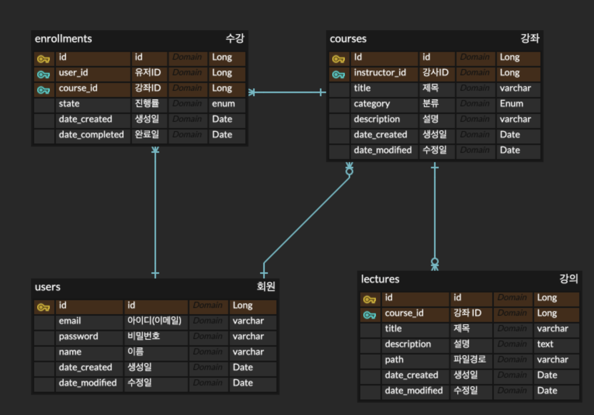
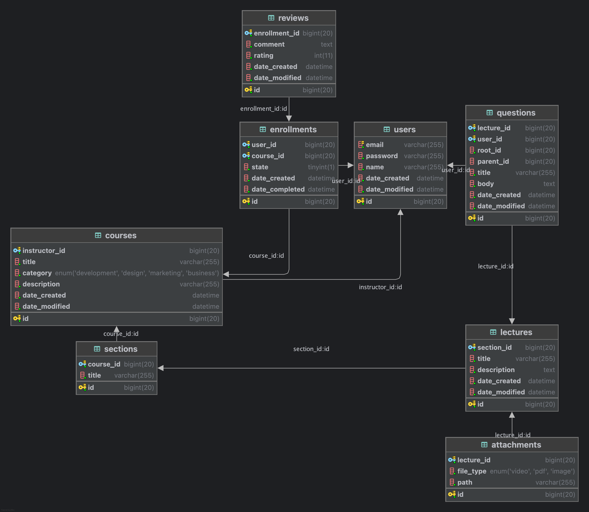

## 🥑 들어가며

현재 나는 원티드 포텐업에 합류한 상태이다. 선택한 계기는 원티드이기도 하고, 면접을 보면서 면접관님?들에게서 열정이 느껴졌기 때문! 또한 대면이기도 했고, 면접 합격 후 들은 세션에서 커리큘럼이 마음에 들었다. 이후 대전을 떠나 잠실로 올라오게 되었다..

첫 1주차인지 2주차인지 강사님께서 팀 스터디를 장려하기 위해 첫 달은 강사님의 주도로 팀을 짜게 되었다. 그 스터디 팀 구성 그대로 어쩌다보니 첫 달 프로젝트까지 하게 된 것이다. 첫 번째 프로젝트로 LXP라는 도메인을 바탕으로 JDBC를 사용하여 콘솔 프로그램을 개발하는 것이 주제였다.

<br>

## 🔖 프로젝트 정보

| Category | Architecture          |
| :------: | :-------------------- |
| Language | Java 17               |
| Database | JDBC, HikariCP, Mysql |
|   Type   | CLI Application       |

나는 User 도메인을 맡게 되었다. 다행히 회원 기능은 다른 기능에 비해 대체적으로 정해져있기도 하고, 그 명칭 또한 정해져있어서 구현하기 편했다. 회원에 `Role`이 들어가 회원과 어드민이 따로 있었다면 꽤 걸렸을 것이나, 다행히 그정도로 딥하게 기능 명세가 나오지 않았다.

### 폴더 구조

```
.
├── course
│   ├── dao
│   ├── exception
│   ├── model
│   │   └── enums
│   ├── presentation
│   │   ├── controller
│   │   │   ├── request
│   │   │   └── response
│   │   └── view
│   └── service
│       └── dto
├── enrollment
│   ├── dao
│   ├── exception
│   ├── model
│   ├── presentation
│   │   ├── controller
│   │   │   ├── request
│   │   │   └── response
│   │   └── view
│   └── service
│       └── dto
├── global
│   ├── base
│   ├── config
│   ├── context
│   ├── exception
│   └── support
├── lecture
│   ├── dao
│   ├── exception
│   ├── model
│   ├── presentation
│   │   └── controller
│   │       └── dto
│   │           ├── request
│   │           └── response
│   └── service
│       └── dto
└── user
    ├── dao
    │   └── vo
    ├── exception
    ├── model
    ├── presentation
    │   ├── controller
    │   │   ├── request
    │   │   └── response
    │   └── view
    ├── security
    └── service
        ├── dto
        └── validator
```


### 기능 명세

- 회원가입
    - 아이디(이메일), 비밀번호, 비밀번호 확인, 닉네임
    - 제약사항
        - 로그인을 하지 않은 상태
        - 비밀번호
            - 영문 대소문자, 숫자, 특수문자를 포함
            - 8자 이상 16자 이하

        - 아이디 중복 불가
        - 닉네임 16자 이하
- 로그인
    - 아이디와 비밀번호를 이용하여 회원정보 조회
    - 제약사항
        - 로그인을 하지 않은 상태
- 비밀번호 찾기
    - 아이디를 이용하여 비밀번호 초기화 및 재설정
    - 제약사항
        - 로그인을 하지 않은 상태
        - 비밀번호
            - 영문 대소문자, 숫자, 특수문자를 포함
            - 8자 이상 16자 이하
- 비밀번호 확인
    - 비밀번호가 일치하는지 확인
    - 제약사항
        - 로그인을 한 상태
        - Boolean값 리턴
- 개인정보 수정
    - 비밀번호 확인에 성공할 시 닉네임 변경 가능
    - 제약사항
        - 로그인을 한 상태
        - 아이디 중복 불가
        - 닉네임 16자 이하
- 회원탈퇴
    - 비밀번호 확인에 성공할 시 회원탈퇴 기능
- 유저 강좌 조회
    - 유저가 등록한 강좌 목록을 조회하는 기능
- 유저 수강 조회
    - 유저가 수강중인 강좌의 목록을 조회하는 기능

### ERD

오랜만에 ERDCloude를 들어가 ERD를 설계하였다.



<br>

## 📌 구현 과정

너무 길어서 몇 가지 포인트만 작성해보고자 한다.

### JDBC

```java

public class UserDao {


    public UserDao() {
    }

    public Optional<UserAuthInfo> findByIdWithPassword(long id) throws LXPDatabaseAccessException {
        String sql = QueryUtil.getQuery("user.findByIdWithPassword");

        try (Connection connection = DBConfig.getInstance().getConnection();
             PreparedStatement pstmt = connection.prepareStatement(sql)) {
            pstmt.setLong(1, id);
            return getUserAuthInfo(pstmt);
        } catch (SQLException e) {
            throw new LXPDatabaseAccessException("아이디 조회 중 데이터베이스 접속 중 오류 발생", e);
        }
    }
    ...
}
```

직접 `PreparedStatement`를 사용하여 DB에 접속하였다. 회사다닐 때 자주 봤던 코드인데 이게 JDBC인지는 처음 알았다..

### 유저 세션

이 프로젝트는 CLI이기 때문에 쿠키나 세션을 사용할 수 없다. 개인적으로 오버스펙이라 생각하기도 했고.. 그래서 `SessionContext`라는 클래스를 만들어 Static으로 띄워놓기로 하였다. 이제 다른 도메인에서 `SessionContext`를 통해 사용자가 로그인된 상태인지 아닌지 확인할 수 있다.

```java

/**
 * 애플리케이션의 현재 로그인된 사용자 상태(세션)를 관리하는 싱글톤 클래스입니다.
 * <p>
 * 이 클래스는 현재 세션 사용자 ID를 저장 및 조회하며,
 * 애플리케이션의 전역적인 상태(Context) 관리를 담당합니다.
 *
 * <h3>세션 사용하기</h3>
 * <pre>
 *     //세션에 있는 사용자의 아이디가 일치하는지 확인
 *     boolean flag = SessionContext.getInstance().isSameId(request.userId());
 * </pre>
 */
public class SessionContext {

    private static final SessionContext INSTANCE = new SessionContext();

    private Long currentUserId;

    private SessionContext() {
    }

    public static SessionContext getInstance() {
        return INSTANCE;
    }

    /**
     * 사용자 ID를 설정하여 로그인 상태로 만듭니다.
     */
    public void setUserId(Long userId) {
        this.currentUserId = userId;
    }

    /**
     * 현재 로그인된 사용자 ID를 반환합니다.
     */
    public Long getUserId() {
        return currentUserId;
    }

    /**
     * 현재 로그인된 사용자와 주어진 ID가 동일한지 확인합니다.
     *
     * @param userId 비교할 사용자 ID
     * @return boolean 현재 로그인된 사용자와 ID가 같으면 true
     */
    public boolean isSameId(Long userId) {
        if (checkId(userId)) {
            return false;
        }

        // Long 타입 비교 시 NullPointerException 방지 및 값 비교를 위해 equals 사용
        return this.currentUserId.equals(userId);
    }

    /**
     * 사용자 ID를 null로 설정하여 로그아웃합니다.
     */
    public void clear() {
        this.currentUserId = null;
    }

    /**
     * 현재 로그인 상태인지 확인합니다.
     */
    public boolean isLoggedIn() {
        return currentUserId != null;
    }

    private boolean checkId(Long userId) {
        return isNull(this.currentUserId) || isNull(userId);
    }

}
```

### 비밀번호 해싱

스프링이었다면 `BCryptPasswordEncoder`를 사용하여 비밀번호 암호화를 할 수 있을 것이다. 그러나 의존성을 추가하기엔 CLI 프로그램이기도 하고 유저에 대한 정보도 이메일과 비밀번호, 닉네임만 있기 때문에 오버 엔지니어링이라 판단하였다. 그래서 따로 비밀번호 인코딩, 디코딩을 하는 메소드를 만들어 사용하였다.

```java

public class Hashing {
    private static final String ALGORITHM = "PBKDF2WithHmacSHA256";
    private static final int ITERATIONS = 65536;
    private static final int KEY_LENGTH = 256;
    private static final int SALT_LENGTH = 16;
    private static final String DELIMITER = ":";

    public static String encode(String password) throws Exception {
        byte[] salt = salt();
        byte[] hash = hash(password.toCharArray(), salt);

        String encodedSalt = Base64.getEncoder().encodeToString(salt);
        String encodedHash = Base64.getEncoder().encodeToString(hash);

        return encodedSalt + DELIMITER + encodedHash;
    }

    public static boolean matches(String inputPassword, String storedHashString) throws Exception {
        String[] parts = divide(storedHashString);
        String encodedSalt = parts[0];
        String encodedHash = parts[1];

        byte[] salt = Base64.getDecoder().decode(encodedSalt);
        byte[] inputHash = hash(inputPassword.toCharArray(), salt);
        String encodedInputHash = Base64.getEncoder().encodeToString(inputHash);

        return encodedInputHash.equals(encodedHash);
    }

    private static byte[] hash(char[] password, byte[] salt) throws NoSuchAlgorithmException, InvalidKeySpecException {
        return SecretKeyFactory.getInstance(ALGORITHM)
            .generateSecret(new PBEKeySpec(password, salt, ITERATIONS, KEY_LENGTH))
            .getEncoded();
    }

    private static byte[] salt() throws NoSuchAlgorithmException {
        SecureRandom random = SecureRandom.getInstanceStrong();
        byte[] salt = new byte[SALT_LENGTH];
        random.nextBytes(salt);
        return salt;
    }

    private static String[] divide(String s) {
        String[] parts = s.split(DELIMITER);
        if (parts.length != 2) {
            throw new LXPException("저장된 해시 문자열 형식이 잘못되었습니다.");
        }
        return parts;
    }
}

```

```java

public class PasswordEncoder {

    public String encode(String password) {
        try {
            return Hashing.encode(password);
        } catch (Exception e) {
            throw new PasswordEncodingException(e);
        }
    }

    public boolean check(String rawPassword, String hashedPassword) {
        try {
            return Hashing.matches(rawPassword, hashedPassword);
        } catch (Exception e) {
            throw new PasswordCheckException(e);
        }
    }

}
```

<br>

## 🚨 Issues

프로젝트를 개발하면서 여러 이슈가 있었다. 우선 개발 도중에 코드 컨벤션을 정하게 돼서 구현 기간이 길어졌다는 것.. 각자 개발을 하다가 "이 부분도 컨벤션으로 정해야하나요?"와 같은 말이 나오면 전부 개발을 멈추고 어떻게 해야할 지 토론을 하였다. 인텔리제이의 코딩 컨벤션 적용하는 기능을 사용해 파일로 정의하였다면 이렇게 오래걸리진 않았을 것이다..

두 번째로 깃허브에 익숙하지 않았던 팀원이 최신 커밋 사항이 올라가있던 `develop` 브랜치에 과거 커밋 내역을 덮어씌우는 바람에 최신 커밋들이 다 날라갔던 적이 있다. 이것도 develop 브랜치를 버리냐 마냐로 토론이 나왔었는데 결국 soft reset을 사용하여 해결했던 것으로 기억한다.

세 번째로 개발 도중에 기능을 축소하게 되었다.



처음에 구상했던 ERD는 이것이었으나 생각보다 위의 이유들로 기능 구현에 차질이 생기면서 ERD를 축소하게 되었다. 반나절동안 회의를 했던 것 같다.

<br>

## 느낀 점

처음에 구상했던 ERD를 구현해냈으면 어땠을까 하는 아쉬움이 있다. 그리고 Dao 클래스에서 DB에 접속하는 부분에서 중복 코드가 많이 발생하는데 이 것을 추상화하여 사용하였다면 더 좋았을 것 같다. 사실 Dao 추상화에 대한 얘기가 나왔었으나, 추상화를 하다간 기능 구현을 다 끝내지 못할 것이라는 우려가 나와 리팩토링 사항으로 넘기게 되었다.

이 외에도 팀원들과 커밋 컨벤션을 정하는 것이 기능 구현보다 어렵게 느껴졌다. 혼자였다면 나의 기준대로 구현하면 됐기 때문에 이런 일에 시간을 쏟을 필요가 없다. 그러나 나 외에도 코드를 만지는 사람이 4명이나 더 있었기 때문에 코드의 컨벤션을 맞출 필요가 있었다. 그러나 여러 사람과 도메인을 분석하여 설계하는 과정은 매우 즐거웠다.

JDBC 프로그램을 CLI로 개발할 일이 그렇게 많지 않기 때문에 귀중한 경험이라 생각한다.